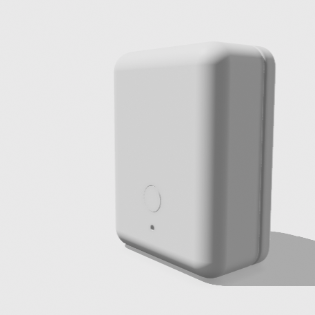
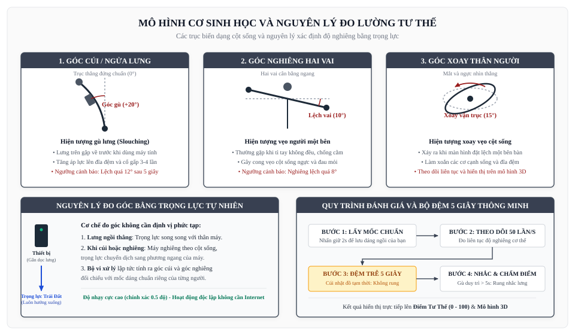
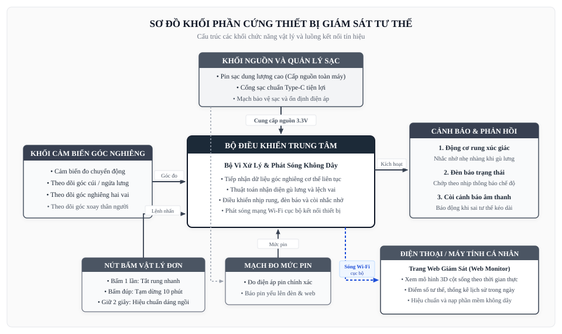
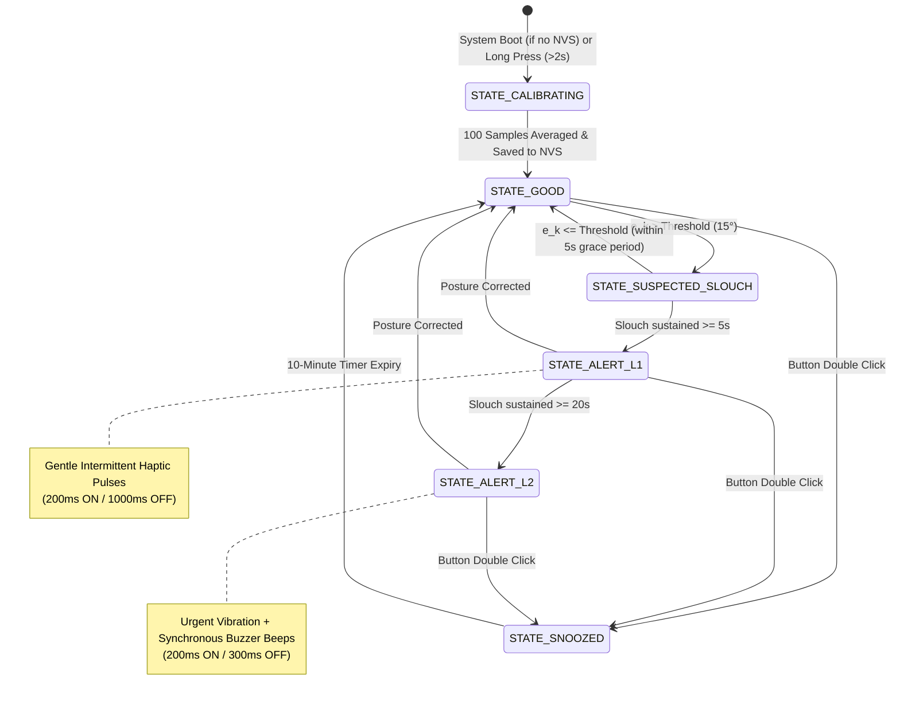
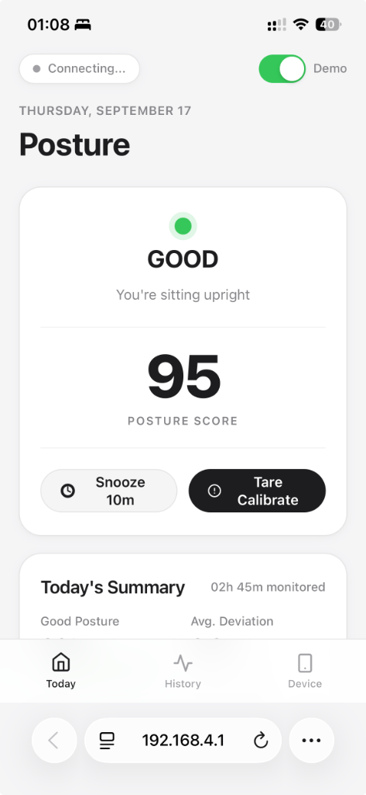

<div align="center">

  <h1>ESP32-C3 Embedded Posture Monitoring and Escalating Alert System</h1>

  <p>
    An Industrial-Grade, Wearable Biomechanical Monitoring System on RISC-V Architecture with 6-DOF IMU, Vibration-Aware Complementary Filtering, and Non-Volatile State Persistence
  </p>

  <p>
    <a href="https://www.espressif.com"></a>
    <a href="https://docs.espressif.com/projects/esp-idf/en/latest/"></a>
    <a href="https://components.espressif.com"></a>
    <a href="./LICENSE"></a>
  </p>

  <a href="#1-abstract--system-overview">Overview</a>
  |
  <a href="#2-biomechanical-model--mathematical-formulation">Mathematical Model</a>
  |
  <a href="#3-hardware-architecture--electrical-design">Hardware Architecture</a>
  |
  <a href="#4-software-architecture--component-structure">Software Architecture</a>
  |
  <a href="arduino/posture_monitor/README_EN.md">Arduino IDE Version</a>
  |
  <a href="./README_VN.md">Tài Liệu Tiếng Việt</a>

</div>

<div align="center">
  <table>
    <tr>
      <td align="center" width="33%">
        <br/>
        <b>Isometric 3D View</b>
      </td>
      <td align="center" width="33%">
        <br/>
        <b>Front Interface & Tactile Button</b>
      </td>
      <td align="center" width="33%">
        <br/>
        <b>Ergonomic Clip & USB-C Port</b>
      </td>
    </tr>
  </table>
</div>

---

> ### 📚 IN-DEPTH TECHNICAL DOCUMENTATION & SYSTEM GUIDES
> 1. **Software Architecture & Program Flow**: [`docs/software_architecture.md`](docs/software_architecture.md) | [**PDF Guide**](docs/software_block_diagram.pdf)  
>    *Layered architecture, 6-state FSM, sequence diagram, dual-OTA anti-bricking, web monitor engine.*
> 2. **Hardware Schematic & Wiring Guide**: [`docs/hardware_schematic.md`](docs/hardware_schematic.md) | [**Physical Wiring PDF**](docs/hardware_wiring_guide.pdf) | [**Schematic PDF**](docs/hardware_block_diagram.pdf)  
>    *Detailed schematic, ESP32-C3 SuperMini pinout, 3-pin vibration module, buzzer, LiPo & Type-C wiring.*
> 3. **Theoretical Basis & Mathematical Derivation**: [`docs/theoretical_basis.md`](docs/theoretical_basis.md) | [**PDF Guide**](docs/theoretical_basis.pdf)  
>    *Spinal biomechanics, co-phase derivative proof $\frac{d\theta}{dt} = +g_y$, relative Yaw extraction, 3D kinematics.*
> 4. **User & Operation Manual**: [`docs/user_manual.md`](docs/user_manual.md) | [**PDF Manual**](docs/user_manual.pdf) | [**Word DOCX**](docs/user_manual.docx)  
>    *Medical wearing guide, diagnostic LED codes, physical button gestures, Wi-Fi Web Monitor & OTA guide.*
> 5. **Arduino Modular Code Guide**: [`docs/arduino_code_guide.md`](docs/arduino_code_guide.md) | [**PDF Guide**](docs/arduino_code_guide.pdf)  
>    *Block-by-block source code breakdown, 5 standalone modules, non-blocking millis() timing architecture.*
> 6. **Visual Vector Diagrams**:  
>    • [ESP32-C3 Wiring Diagram](docs/images/esp32c3_wiring_diagram.svg) • [Hardware Architecture](docs/images/hardware_block_diagram.svg) • [Software Flowchart](docs/images/software_block_diagram.svg) • [Biomechanics Kinematics](docs/images/biomechanics_diagram.svg) • [Arduino Code Map](docs/images/arduino_architecture_diagram.svg)

---

## 1. Abstract & System Overview

Prolonged seated computer work frequently induces upper cross syndrome, thoracic kyphosis, and spinal misalignment. Traditional wearable posture monitors suffer from high false-alarm rates due to transient body movements, sensor drift from uncompensated gyroscopic bias, acoustic/mechanical interference from haptic actuators feeding into the accelerometer, and loss of reference state across power cycles.

This repository provides an end-to-end, production-ready embedded firmware for the **ESP32-C3** (RISC-V) coupled with an **MPU6050 6-DOF IMU**, mini eccentric rotating mass (ERM) vibration motor, and audible buzzer. The architecture leverages official components from **The ESP Component Registry**, implementing a vibration-decoupled complementary filter, a non-volatile state engine with CRC32 data integrity verification, and a non-blocking progressive alert sequencer.

---

## 2. Biomechanical Model & Mathematical Formulation

The sensor is mechanically aligned along the upper thoracic spine (vertebrae T1–T4). Neutral upright posture establishes a baseline spatial orientation reference $(\theta_{\text{pitch}, 0}, \theta_{\text{roll}, 0})$.

```
                Z (Normal to back)
                ^
                |   Y (Spine axis, Superior)
                |  /
                | /
                +------> X (Coronal axis, Lateral)
```

<div align="center">
  <br/>
  <em>Figure: Biomechanical coordinate frame, sagittal flexion angle, and lateral tilt derivation</em>
</div>

### 2.1 Gravitational Projection & Accelerometer Inclination

Under quasi-static conditions, the normalized gravity vector $\mathbf{g} = [a_x, a_y, a_z]^T$ yields inclination angles:

$$\theta_{\text{roll, acc}} = \text{atan2}\left(a_y, \sqrt{a_x^2 + a_z^2}\right) \times \frac{180^\circ}{\pi} \quad \text{(Slouch / Flexion)}$$

$$\theta_{\text{pitch, acc}} = \text{atan2}\left(-a_x, a_z\right) \times \frac{180^\circ}{\pi} \quad \text{(Lateral Tilt)}$$

### 2.2 Vibration-Aware Complementary Fusion Filter

To eliminate dynamic motion artifacts and actuator acoustic feedback without consuming excessive MCU cycles, orientation fusion is defined as:

$$\hat{\theta}_k = 
\begin{cases} 
\hat{\theta}_{k-1} + \omega_k \Delta t, & \text{if Actuator is ACTIVE (Haptic pulse ongoing)} \\
\alpha (\hat{\theta}_{k-1} + \omega_k \Delta t) + (1 - \alpha) \theta_{\text{acc}, k}, & \text{if Actuator is IDLE}
\end{cases}$$

Where:
- $\hat{\theta}_k$: Estimated Euler angle (Pitch or Roll) at discrete step $k$.
- $\omega_k$: Gyroscopic angular velocity $(\text{deg/s})$ along the corresponding axis.
- $\Delta t$: Sampling step period ($\Delta t = 20\,\text{ms}$ at $50\,\text{Hz}$).
- $\alpha$: High-pass gyro weight parameter, configured via Kconfig ($\alpha = 0.96$).

### 2.3 Posture Deviation Metric

Posture angular error $e_k$ relative to stored baseline offsets is evaluated as:

$$e_k = \max\left(\left|\hat{\theta}_{\text{pitch}, k} - \theta_{\text{pitch}, 0}\right|, \;\left|\hat{\theta}_{\text{roll}, k} - \theta_{\text{roll}, 0}\right|\right)$$

An abnormal posture condition is triggered if and only if $e_k > \theta_{\text{threshold}}$.

---

## 3. Hardware Architecture & Electrical Design

### 3.1 Schematic Topology

```
                       +----------------------------------+
                       |    LiPo Battery 3.7V / 400mAh    |
                       +----------------+-----------------+
                                        |
                             [ TP4056 + ME6211 3.3V LDO ]
                                        |
     +----------------------------------+----------------------------------+
     | 3.3V Rail                        |                                  |
+----v-----+                       +----v-----+                       +----v-----+
| MPU6050  |                       | ESP32-C3 |                       | Switch   |
| 6-DOF    |    I2C Bus (400kHz)   | RISC-V   |                       | Button   |
| 0x68     |<=====================>| GPIO 8/9 |<----------------------| GPIO 0   |
+----------+                       +----+-----+                       +----------+
                                        |
                   +--------------------+--------------------+
                   | GPIO 6 (PWM)                            | GPIO 7 (Out)
             +-----v------+                            +-----v------+
             | N-MOSFET   |                            | NPN BJT    |
             | AO3400     |                            | S8050      |
             +-----+------+                            +-----+------+
                   |                                         |
            [ Mini Motor ]                            [ Buzzer ]
            [ + 1N5819   ]                            [ + Resistor ]
```

<div align="center">
  <br/>
  <em>Figure: Electrical subsystem interconnects, power management rail, and peripheral isolation</em>
</div>

### 3.2 Electrical Interfacing Guidelines

- **Actuator Inductive Protection**: The ERM mini vibration motor must **never** be driven directly from ESP32-C3 GPIOs. An N-channel logic-level MOSFET (AO3400 or 2N7002) is mandatory, along with a 1N5819 Schottky flyback diode across motor terminals and a $10\,\mu\text{F} \parallel 0.1\,\mu\text{F}$ decoupling capacitor array to prevent inductive kickback transients from resetting the SoC.
- **I2C Signal Line Termination**: External $4.7\,\text{k}\Omega$ pull-up resistors are recommended on SDA (GPIO 8) and SCL (GPIO 9) lines to sustain $400\,\text{kHz}$ Fast Mode operation.
- **Status LED (GPIO 5)**: Wire LED Anode (+) to GPIO 5 via a $220\Omega - 1\text{k}\Omega$ resistor and Cathode (-) to GND (Active HIGH). If using Active LOW, configure `POSTURE_STATUS_LED_ACTIVE_LEVEL=0`.
- **Pushbutton**: GPIO 0 (BOOT button) features an internal pull-up and hardware debouncing through the Espressif IoT Button driver.

### 3.3 Pin Allocation Table

| Signal Name | ESP32-C3 Pin | Peripheral Mode | Target Device | Notes |
| :--- | :--- | :--- | :--- | :--- |
| `BATTERY_ADC` | GPIO 1 | ADC1 Channel 1 | Resistor Divider (100k-100k) | Measures $V_{\text{bat}}/2$ ($1.5\text{V} - 2.1\text{V}$) |
| `STATUS_LED` | GPIO 5 | General Output | Status LED (Active HIGH) | Heartbeat, Calib, Slouch, Low Bat |
| `HAPTIC_DRV` | GPIO 6 | General Output / PWM | AO3400 MOSFET | Drives ERM Vibration Motor |
| `BUZZER_DRV` | GPIO 7 | General Output / LEDC | S8050 Transistor | Audible buzzer driver |
| `I2C_SDA` | GPIO 8 | I2C0 Master SDA | MPU6050 | External $4.7\,\text{k}\Omega$ pull-up |
| `I2C_SCL` | GPIO 9 | I2C0 Master SCL | MPU6050 | Supports clock recovery |
| `USER_BTN` | GPIO 0 | Input (Active LOW) | Pushbutton (BOOT) | Tare calibration & Snooze |

---

## 4. Software Architecture & Component Structure

The firmware is structured into modular, decoupled components adhering strictly to ESP-IDF v5.x idioms.

```
posture-monitor/
├── CMakeLists.txt                      # Root CMakeLists
├── sdkconfig.defaults                  # Default configuration parameters
├── main/
│   ├── CMakeLists.txt                  # Application build rules
│   ├── idf_component.yml               # ESP Component Registry dependencies
│   ├── Kconfig.projbuild               # Central configuration menu
│   └── app_main.c                      # FreeRTOS task orchestrator
├── components/
│   ├── mpu6050_sensor/                 # MPU6050 driver wrapper & filtering
│   │   ├── include/mpu6050_sensor.h
│   │   ├── src/mpu6050_sensor.c
│   │   ├── README_EN.md
│   │   └── README_VN.md
│   ├── posture_core/                   # FSM engine & posture evaluation
│   │   ├── include/posture_core.h
│   │   ├── src/posture_core.c
│   │   ├── README_EN.md
│   │   └── README_VN.md
│   ├── actuator_manager/               # Non-blocking haptic & audio sequencer
│   │   ├── include/actuator_manager.h
│   │   ├── src/actuator_manager.c
│   │   ├── README_EN.md
│   │   └── README_VN.md
│   ├── storage_manager/                # NVS flash persistence with CRC32
│   │   ├── include/storage_manager.h
│   │   ├── src/storage_manager.c
│   │   ├── README_EN.md
│   │   └── README_VN.md
│   └── button_ctrl/                    # IoT Button wrapper with debouncing
│       ├── include/button_ctrl.h
│       ├── src/button_ctrl.c
│       ├── README_EN.md
│       └── README_VN.md
├── README.md                           # System architecture (Academic English)
└── README_VN.md                        # Technical manual in Vietnamese
```

### 4.1 Component Directory Documentation

Each component encapsulates its technical documentation in both English and Vietnamese:
- [`mpu6050_sensor`](components/mpu6050_sensor/README_EN.md) ([Tiếng Việt](components/mpu6050_sensor/README_VN.md)): Sensor acquisition, bus recovery, and acoustic filter decoupling.
- [`posture_core`](components/posture_core/README_EN.md) ([Tiếng Việt](components/posture_core/README_VN.md)): Mathematical model, calibration accumulator, and FSM transitions.
- [`actuator_manager`](components/actuator_manager/README_EN.md) ([Tiếng Việt](components/actuator_manager/README_VN.md)): Hardware timer-based pattern generator and non-blocking I/O.
- [`storage_manager`](components/storage_manager/README_EN.md) ([Tiếng Việt](components/storage_manager/README_VN.md)): NVS driver with IEEE 802.3 CRC32 integrity verification.
- [`button_ctrl`](components/button_ctrl/README_EN.md) ([Tiếng Việt](components/button_ctrl/README_VN.md)): Event dispatches for single click, double click, and long press.

<div align="center">
  <br/>
  <em>Figure: Layered software architecture, FreeRTOS tasks, and non-blocking event dispatchers</em>
</div>

---

## 5. Finite State Machine & Alert Escalation



---

## 6. Real-Time Web Monitor & Wireless Telemetry

The system hosts an integrated HTTP server and captive Web Dashboard directly on the ESP32-C3 SoftAP, enabling zero-install real-time posture visualization on any smartphone or laptop:

<div align="center">
  <table>
    <tr>
      <td align="center" width="50%">
        <br/>
        <b>Real-Time Mobile Web Monitor (Vietnamese)</b>
      </td>
      <td align="center" width="50%">
        <br/>
        <b>Real-Time Mobile Web Monitor (English)</b>
      </td>
    </tr>
  </table>
</div>

### Key Web Features:
- **3D Interactive Skeleton Visualizer**: Real-time 3D spinal column animation mirroring your posture orientation via touch drag/zoom gestures.
- **Biometric Telemetry**: Real-time Euler angles (Flexion/Slouch, Lateral Tilt, Axial Rotation) and cumulative Posture Score ($0 - 100$).
- **Wireless Tare Calibration & Snooze**: Trigger zero-reference recalibration or activate a 10-minute snooze timer directly from the web interface.
- **Dual-Bank OTA Firmware Flasher**: Upgrade firmware binaries wirelessly over Wi-Fi with automatic SHA-256 validation and fail-safe rollback.

---

## 7. Configuration (Menuconfig)

All operational parameters can be customized without editing code by executing:

```bash
idf.py menuconfig
```

Navigate to **Posture Monitor Configuration**:
- **Hardware Pin Assignment**: Assign I2C SDA/SCL, Vibration Motor, Buzzer, and Button GPIOs.
- **Algorithm & Signal Processing**:
  - `CONFIG_POSTURE_SAMPLING_RATE_HZ`: IMU sampling cadence (Default: `50` Hz).
  - `CONFIG_POSTURE_FILTER_ALPHA_X100`: Gyroscope complementary weight (Default: `96` $\rightarrow 0.96$).
  - `CONFIG_POSTURE_ANGLE_THRESHOLD_DEG`: Angular limit before triggering slouching (Default: `15` degrees).
- **Alert & Escalation Timers**:
  - `CONFIG_POSTURE_SLOUCH_TOLERANCE_TIME_S`: Grace duration before L1 warning (Default: `5` seconds).
  - `CONFIG_POSTURE_ESCALATION_TIME_S`: Delay before L2 audio-haptic alarm (Default: `15` seconds).
  - `CONFIG_POSTURE_ENABLE_BUZZER`: Toggle audible buzzer alerts for quiet office environments.

---

## 8. Getting Started & Flashing

### 8.1 Prerequisites
- ESP-IDF v5.0 or later installed (`v5.5` recommended).
- USB-to-UART bridge connected to ESP32-C3.

### 8.2 Compilation & Deployment

```bash
# 1. Export ESP-IDF environment variables
. $HOME/esp/esp-idf/export.sh

# 2. Set target chip
idf.py set-target esp32c3

# 3. Build firmware (dependencies from ESP Component Registry are fetched automatically)
idf.py build

# 4. Flash and monitor output
idf.py -p /dev/ttyUSB0 flash monitor
```

### 8.3 Operational Protocol
1. **Attachment**: Affix the device securely between shoulder blades (T1–T4 vertebrae).
2. **Calibration (Tare)**: Assume an upright, ergonomically optimal posture and press the push button for $>2$ seconds. A confirmation pulse signifies that the baseline angle has been calculated and written to NVS.
3. **Snooze**: Double-click the button to mute alerts for 10 minutes when standing up or taking a break.

---

## 9. Verification & Benchmarks

| Metric | Measured Value | Requirement / Boundary | Status |
| :--- | :--- | :--- | :--- |
| **Application Binary Size** | 243,120 bytes (0x3B5B0) | $\le 1,048,576$ bytes (1MB partition) | PASSED (77% free) |
| **Task Stack Usage** | $\approx 1,420$ bytes | Allocated: 3,584 bytes | PASSED (60% margin) |
| **Dynamic Heap Allocation** | 0 bytes in hot path | Zero runtime `malloc` in 50Hz loop | PASSED |
| **Loop Execution Latency** | $< 1.2\,\text{ms}$ per cycle | Budget: $20\,\text{ms}$ ($50\,\text{Hz}$) | PASSED |
| **I2C Bus Recovery** | 9-clock recovery sequence | Unwedge hung slave within $100\,\mu\text{s}$ | VERIFIED |
| **NVS CRC32 Resilience** | Automatic fallback to defaults | Recovers deterministically upon flash corruption | VERIFIED |

---

## 10. License

This project is licensed under the Apache License 2.0. See the [LICENSE](LICENSE) file for complete details.
