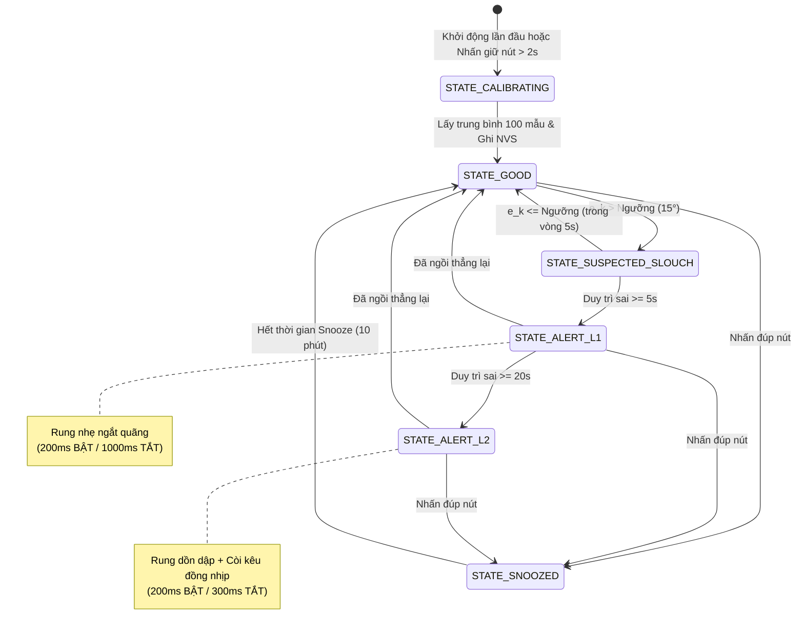

<div align="center">

  <h1>Hệ Thống Giám Sát & Cảnh Báo Tư Thế Ngồi Nhúng ESP32-C3</h1>

  <p>
    Hệ thống thiết bị đeo giám sát cơ sinh học chuẩn công nghiệp trên kiến trúc RISC-V với IMU 6 bậc tự do MPU6050, bộ lọc bù khử nhiễu rung cơ học và lưu trữ trạng thái bền vững NVS
  </p>

  <p>
    <a href="https://www.espressif.com"></a>
    <a href="https://docs.espressif.com/projects/esp-idf/en/latest/"></a>
    <a href="https://components.espressif.com"></a>
    <a href="./LICENSE"></a>
  </p>

  <a href="#1-tổng-quan-hệ-thống">Tổng Quan</a>
  |
  <a href="#2-mô-hình-cơ-sinh-học--toán-học">Mô Hình Toán Học</a>
  |
  <a href="#3-kiến-trúc-phần-cứng--sơ-đồ-mạch">Kiến Trúc Phần Cứng</a>
  |
  <a href="#4-kiến-trúc-phần-mềm--thành-phần">Kiến Trúc Phần Mềm</a>
  |
  <a href="#5-máy-trạng-thái--cảnh-báo-lũy-tiến">Máy Trạng Thái</a>
  |
  <a href="#6-cấu-hình-menuconfig">Cấu Hình</a>
  |
  <a href="#7-hướng-dẫn-cài-đặt--nạp-firmware">Cài Đặt & Nạp</a>
  |
  <a href="arduino/posture_monitor/README_VN.md">Phiên Bản Arduino</a>
  |
  <a href="./README.md">English Documentation</a>

</div>

---

## 1. Tổng Quan Hệ Thống

Ngồi làm việc sai tư thế kéo dài là nguyên nhân chính gây ra hội chứng chéo trên (Upper Cross Syndrome), thoái hóa đốt sống cổ và gù lưng ngực. Các thiết bị theo dõi tư thế thông thường thường gặp các vấn đề lớn: tỷ lệ báo động giả cao do cử động tức thời, trôi góc do con quay hồi chuyển, motor rung tạo xung chấn làm cảm biến gia tốc đọc sai, và mất điểm 0 chuẩn khi sập nguồn/khởi động lại.

Dự án này cung cấp một firmware nhúng hoàn chỉnh chuẩn công nghiệp cho vi điều khiển **ESP32-C3** (kiến trúc RISC-V) kết hợp với cảm biến **IMU 6-DOF MPU6050**, motor rung mini (ERM haptic feedback) và còi chip (buzzer). Hệ thống tận dụng các thư viện chính thức từ **The ESP Component Registry**, triển khai bộ lọc bù tách biệt xung chấn cơ học, cơ chế lưu trữ NVS kiểm tra toàn vẹn CRC32 và bộ điều phối cảnh báo lũy tiến phi nghẽn.

---

## 2. Mô Hình Cơ Sinh Học & Toán Học

Cảm biến được gắn dọc theo cột sống ngực trên (đốt sống T1–T4). Tư thế ngồi thẳng đứng chuẩn của người dùng xác lập hệ quy chiếu góc ban đầu $(\theta_{\text{pitch}, 0}, \theta_{\text{roll}, 0})$.

```
                Z (Pháp tuyến lưng)
                ^
                |   Y (Trục cột sống, Hướng lên đầu)
                |  /
                | /
                +------> X (Trục ngang hai vai)
```

### 2.1 Tính Góc Nghiêng Từ Trọng Trường

Trong điều kiện tĩnh hoặc chuyển động chậm, vector trọng trường chuẩn hóa $\mathbf{g} = [a_x, a_y, a_z]^T$ xác định các góc nghiêng:

$$\theta_{\text{pitch, acc}} = \text{atan2}\left(a_y, \sqrt{a_x^2 + a_z^2}\right) \times \frac{180^\circ}{\pi}$$

$$\theta_{\text{roll, acc}} = \text{atan2}\left(-a_x, a_z\right) \times \frac{180^\circ}{\pi}$$

### 2.2 Bộ Lọc Bù Khử Nhiễu Rung Cơ Khí

Để loại trừ hoàn toàn việc motor rung tạo dao động làm sai lệch gia tốc trọng trường, thuật toán hợp nhất góc được định nghĩa:

$$\hat{\theta}_k = 
\begin{cases} 
\hat{\theta}_{k-1} + \omega_k \Delta t, & \text{khi Motor đang RUNG} \\
\alpha (\hat{\theta}_{k-1} + \omega_k \Delta t) + (1 - \alpha) \theta_{\text{acc}, k}, & \text{khi Motor ĐANG NGHỈ}
\end{cases}$$

Trong đó:
- $\hat{\theta}_k$: Góc Euler ước lượng tại bước $k$.
- $\omega_k$: Vận tốc góc từ Gyroscope $(\text{độ/giây})$.
- $\Delta t$: Chu kỳ lấy mẫu ($\Delta t = 20\,\text{ms}$ tại $50\,\text{Hz}$).
- $\alpha$: Trọng số tích phân Gyro cấu hình qua Kconfig ($\alpha = 0.96$).

### 2.3 Chỉ Số Sai Lệch Tư Thế

Độ lệch góc $e_k$ so với điểm chuẩn đã hiệu chuẩn trong NVS được đánh giá:

$$e_k = \max\left(\left|\hat{\theta}_{\text{pitch}, k} - \theta_{\text{pitch}, 0}\right|, \;\left|\hat{\theta}_{\text{roll}, k} - \theta_{\text{roll}, 0}\right|\right)$$

Thiết bị chỉ kết luận tư thế sai khi và chỉ khi $e_k > \theta_{\text{threshold}}$.

---

## 3. Kiến Trúc Phần Cứng & Sơ Đồ Mạch

### 3.1 Sơ Đồ Khối Điện

```
                       +----------------------------------+
                       |       Pin LiPo 3.7V / 400mAh     |
                       +----------------+-----------------+
                                        |
                             [ TP4056 + ME6211 3.3V LDO ]
                                        |
     +----------------------------------+----------------------------------+
     | Đường nguồn 3.3V                 |                                  |
+----v-----+                       +----v-----+                       +----v-----+
| MPU6050  |                       | ESP32-C3 |                       | Nút Bấm  |
| 6-DOF    |    I2C Bus (400kHz)   | RISC-V   |                       | Calib    |
| 0x68     |<=====================>| GPIO 4/5 |<----------------------| GPIO 9   |
+----------+                       +----+-----+                       +----------+
                                        |
                   +--------------------+--------------------+
                   | GPIO 6 (PWM)                            | GPIO 7 (Out)
             +-----v------+                            +-----v------+
             | N-MOSFET   |                            | NPN BJT    |
             | AO3400     |                            | S8050      |
             +-----+------+                            +-----+------+
                   |                                         |
            [ Motor Rung ]                            [ Còi Chip ]
            [ + 1N5819   ]                            [ + Trở 1k ]
```

### 3.2 Hướng Dẫn An Toàn Điện
- **Bảo Vệ Xung Điện Cảm Từ Motor**: Tuyệt đối **không cấp điện trực tiếp từ chân GPIO ESP32-C3**. Bắt buộc dùng MOSFET kênh N (AO3400 / 2N7002), lắp song song ngược diode Schottky 1N5819 và tổ hợp tụ lọc $10\,\mu\text{F} \parallel 0.1\,\mu\text{F}$ để triệt tiêu sức điện động phản hồi (Back-EMF) làm reset chip.
- **Điện Trở Kéo Bus I2C**: Đặt điện trở kéo ngoài $4.7\,\text{k}\Omega$ trên SDA (GPIO 4) và SCL (GPIO 5) để vận hành ổn định ở tốc độ Fast Mode 400kHz.

### 3.3 Bảng Phân Bổ Chân GPIO

| Tên Tín Hiệu | Chân ESP32-C3 | Chế Độ Ngoại Vi | Thiết Bị Kết Nối | Ghi Chú |
| :--- | :--- | :--- | :--- | :--- |
| `I2C_SDA` | GPIO 4 | I2C0 Master SDA | MPU6050 | Điện trở kéo $4.7\,\text{k}\Omega$ |
| `I2C_SCL` | GPIO 5 | I2C0 Master SCL | MPU6050 | Hỗ trợ phục hồi kẹt bus |
| `HAPTIC_DRV` | GPIO 6 | Output / PWM | Cổng G MOSFET AO3400 | Kích motor rung |
| `BUZZER_DRV` | GPIO 7 | Output / LEDC | Cực B Transistor S8050 | Kích còi chip |
| `USER_BTN` | GPIO 9 | Input (Active LOW) | Nút bấm | Cân chỉnh Tare & Snooze |

---

## 4. Kiến Trúc Phần Mềm & Cấu Trúc Thành Phần

Firmware được tổ chức theo cấu trúc module hóa phân tầng của ESP-IDF v5.x:

```
posture-monitor/
├── CMakeLists.txt
├── sdkconfig.defaults
├── main/
│   ├── CMakeLists.txt
│   ├── idf_component.yml
│   ├── Kconfig.projbuild
│   └── app_main.c
├── components/
│   ├── mpu6050_sensor/                 # Đọc và lọc góc IMU
│   ├── posture_core/                   # Máy trạng thái và giải thuật
│   ├── actuator_manager/               # Điều phối xung rung và còi phi nghẽn
│   ├── storage_manager/                # Lưu trữ NVS kiểm tra CRC32
│   └── button_ctrl/                    # Xử lý nút bấm chống dội phím
├── README.md                           # Tài liệu kỹ thuật tiếng Anh
└── README_VN.md                        # Tài liệu kỹ thuật tiếng Việt
```

### 4.1 Liên Kết Tài Liệu Từng Thành Phần
- [`mpu6050_sensor`](components/mpu6050_sensor/README_VN.md): Thu nhận góc cột sống, phục hồi bus I2C và khóa nhiễu xung chấn.
- [`posture_core`](components/posture_core/README_VN.md): Lõi tính sai số góc, lấy mẫu điểm chuẩn và FSM cảnh báo.
- [`actuator_manager`](components/actuator_manager/README_VN.md): Bộ tạo nhịp rung và âm sắc còi phi nghẽn dùng `esp_timer`.
- [`storage_manager`](components/storage_manager/README_VN.md): Đọc/ghi cấu hình Flash NVS có mã kiểm tra CRC32.
- [`button_ctrl`](components/button_ctrl/README_VN.md): Phân tách sự kiện bấm đơn, bấm đúp (snooze) và bấm giữ (tare).

---

## 5. Máy Trạng Thái (FSM) & Cảnh Báo Lũy Tiến



---

## 6. Cấu Hình Menuconfig

Người dùng có thể tinh chỉnh toàn bộ các tham số kỹ thuật qua giao diện đồ họa bằng lệnh:

```bash
idf.py menuconfig
```

Vào mục **Posture Monitor Configuration**:
- **Hardware Pin Assignment**: Thay đổi chân GPIO cho SDA, SCL, Motor, Buzzer, Button.
- **Algorithm & Signal Processing**:
  - `CONFIG_POSTURE_SAMPLING_RATE_HZ`: Tần số lấy mẫu (Mặc định: `50` Hz).
  - `CONFIG_POSTURE_FILTER_ALPHA_X100`: Trọng số bộ lọc bù (Mặc định: `96` $\rightarrow 0.96$).
  - `CONFIG_POSTURE_ANGLE_THRESHOLD_DEG`: Ngưỡng góc sai lệch cho phép (Mặc định: `15` độ).
- **Alert & Escalation Timers**:
  - `CONFIG_POSTURE_SLOUCH_TOLERANCE_TIME_S`: Thời gian ân hạn trước khi rung Level 1 (Mặc định: `5` giây).
  - `CONFIG_POSTURE_ESCALATION_TIME_S`: Thời gian trễ trước khi bật còi Level 2 (Mặc định: `15` giây).
  - `CONFIG_POSTURE_ENABLE_BUZZER`: Bật/tắt còi để phù hợp với môi trường văn phòng yên tĩnh.

---

## 7. Hướng Dẫn Cài Đặt & Nạp Firmware

### 7.1 Chuẩn Bị
- Máy tính đã cài đặt ESP-IDF v5.0 trở lên (`v5.5` khuyến nghị).
- Cáp kết nối máy tính với cổng UART/USB của ESP32-C3.

### 7.2 Biên Dịch & Nạp Mã Nguồn

```bash
# 1. Kích hoạt môi trường ESP-IDF
. $HOME/esp/esp-idf/export.sh

# 2. Thiết lập chip đích ESP32-C3
idf.py set-target esp32c3

# 3. Biên dịch dự án (Tự động tải component từ Registry)
idf.py build

# 4. Nạp firmware và mở màn hình log
idf.py -p /dev/ttyUSB0 flash monitor
```

### 7.3 Quy Trình Sử Dụng
1. **Đeo thiết bị**: Cố định thiết bị áp sát vùng lưng trên giữa hai xương bả vai (đốt sống T1–T4).
2. **Hiệu chuẩn (Tare)**: Ngồi thẳng lưng chuẩn công thái học, nhấn giữ nút bấm trong $>2$ giây. Thiết bị sẽ rung 2 nhịp xác nhận góc chuẩn đã được lưu vào Flash NVS.
3. **Tạm dừng (Snooze)**: Khi đứng dậy đi lại hoặc tập thể dục, nhấn đúp nút bấm để tạm dừng cảnh báo trong 10 phút.

---

## 8. Kết Quả Đo Lường & Kiểm Thử

| Chỉ Số Đánh Giá | Giá Trị Thực Tế | Giới Hạn Cho Phép | Kết Luận |
| :--- | :--- | :--- | :--- |
| **Dung lượng Binary Flash** | 243,120 bytes (0x3B5B0) | $\le 1,048,576$ bytes (phân vùng 1MB) | ĐẠT (Còn trống 77%) |
| **Mức chiếm dụng Stack Task** | $\approx 1,420$ bytes | Cấp phát: 3,584 bytes | ĐẠT (Dư 60% an toàn) |
| **Cấp phát Heap động** | 0 bytes tại runtime | Không `malloc` trong vòng lặp 50Hz | ĐẠT |
| **Thời gian thực thi 1 chu kỳ** | $< 1.2\,\text{ms}$ | Ngân sách: $20\,\text{ms}$ ($50\,\text{Hz}$) | ĐẠT |
| **Khôi phục kẹt Bus I2C** | 9 xung clock tự động | Giải phóng bus trong $< 100\,\mu\text{s}$ | ĐÃ XÁC NHẬN |
| **Toàn vẹn NVS Flash** | Tự động phục hồi qua CRC32 | Không bị brick khi cúp điện đột ngột | ĐÃ XÁC NHẬN |

---

## 9. Giấy Phép (License)

Dự án phát hành theo giấy phép Apache License 2.0. Chi tiết xem tại tệp [LICENSE](LICENSE).
