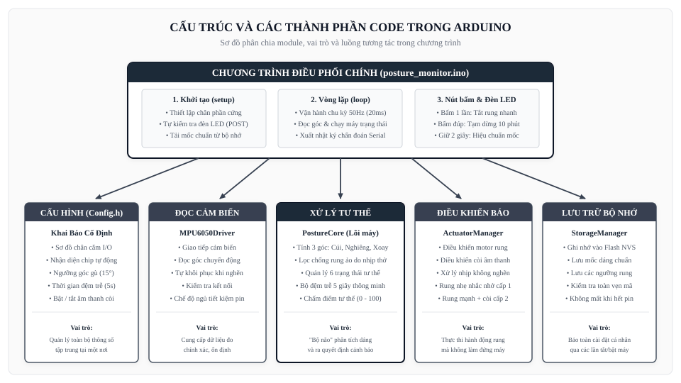

# CẤU TRÚC VÀ CÁC THÀNH PHẦN CODE TRONG ARDUINO

> **Dự án**: Máy Giám Sát Và Cảnh Báo Tư Thế Ngồi (Arduino ESP32 / ESP32-C3)  
> **Tài liệu**: Hướng Dẫn Giải Thích Các Khối Chức Năng Và Module Mã Nguồn  
> **Phiên bản Firmware**: v1.1.2  
> **Ngày cập nhật**: 2026-09-20  

---

## TỔNG QUAN KIẾN TRÚC PHÂN KHỐI TRONG CHƯƠNG TRÌNH

Toàn bộ mã nguồn Arduino được thiết kế theo nguyên tắc **chia nhỏ thành từng module độc lập (Modular Design)**. Mỗi khối đảm nhiệm duy nhất một chức năng rõ ràng, giúp mã nguồn ngắn gọn, dễ đọc, dễ bảo trì và mở rộng:

*Tóm tắt vai trò các khối*: Chương trình chính `posture_monitor.ino` đóng vai trò là "nhạc trưởng" điều phối hoạt động ở chu kỳ 50 lần mỗi giây. Module cấu hình `Config.h` quản lý toàn bộ chân cắm và ngưỡng góc. Module cảm biến đọc số liệu chuyển động; Module xử lý tính toán độ lệch tư thế; Module cảnh báo điều khiển nhịp rung/còi mà không làm đứng máy; Module lưu trữ bảo toàn cài đặt vào bộ nhớ vĩnh viễn.

---

## 1. CHI TIẾT 5 MODULE CHỨC NĂNG ĐỘC LẬP

| Tên Module / Tệp | Thành phần khai báo chính | Chức năng và nhiệm vụ cụ thể |
| :--- | :--- | :--- |
| **Khối Cấu Hình** (`Config.h`) | • Khai báo chân cắm I/O • Ngưỡng góc gù (15°) • Thời gian đệm trễ (5s) • Thời gian tạm dừng (10p) | Tập trung toàn bộ hằng số hệ thống tại một nơi; tự động nhận diện phần cứng (ESP32-C3 hoặc ESP32 Classic) và ngăn chặn việc gán nhầm chân cắm gây lỗi vi mạch. |
| **Khối Cảm Biến** (`MPU6050Driver`) | • `begin()`: Bật cảm biến • `readRaw()`: Đọc số liệu • `sleep()` / `wakeUp()` | Giao tiếp với cảm biến đo chuyển động; tích hợp cơ chế tự động khôi phục đường truyền khi bị gián đoạn tiếp xúc và hỗ trợ chế độ ngủ sâu để tiết kiệm pin. |
| **Khối Xử Lý Tư Thế** (`PostureCore`) | • 3 góc: Cúi, Nghiêng, Xoay • 6 trạng thái tư thế • Bộ đệm trễ 5 giây • Điểm tư thế (0 - 100) | Được xem là "bộ não" tính toán; so sánh dáng ngồi hiện tại với mốc chuẩn đã lưu; lọc bỏ các rung động giả do hô hấp; phân loại trạng thái ngồi đúng hay sai và chấm điểm chất lượng tư thế. |
| **Khối Điều Khiển Báo** (`ActuatorManager`) | • `setPattern()`: Chọn nhịp • `update()`: Cập nhật nhịp • `isVibrating()`: Trạng thái | Điều khiển động cơ rung và còi theo các nhịp điệu quy định (rung nhẹ nhắc nhở cấp 1, rung dồn dập kèm còi cấp 2); vận hành phi nghẽn, không làm gián đoạn các tác vụ khác. |
| **Khối Lưu Trữ** (`StorageManager`) | • `loadCalibration()` • `saveCalibration()` • Kiểm tra toàn vẹn mã | Ghi nhớ mốc tư thế chuẩn và các cài đặt vào bộ nhớ Flash (NVS) của chip; dữ liệu được bảo vệ an toàn, không bị mất ngay cả khi người dùng tắt máy hoặc hết pin. |

---

## 2. CHƯƠNG TRÌNH ĐIỀU PHỐI CHÍNH (posture_monitor.ino)

Tệp chính `posture_monitor.ino` thực thi 4 nhiệm vụ cốt lõi:

1. **Khởi tạo hệ thống (`setup`)**: Thiết lập chế độ các chân nút bấm, đèn LED và còi; chớp nhanh đèn LED 3 lần để tự kiểm tra nguồn điện (POST); tải mốc tư thế chuẩn từ bộ nhớ trong và đánh thức cảm biến sẵn sàng làm việc.
2. **Vòng lặp chính (`loop`)**: Vận hành tuần hoàn đều đặn ở tần số 50Hz (chu kỳ 20ms); lần lượt đọc cảm biến, kiểm tra nút bấm, cập nhật nhịp đèn LED, kích hoạt rung nếu phát hiện ngồi sai và in thông số chẩn đoán ra màn hình máy tính mỗi 5 giây.
3. **Xử lý nút bấm thông minh (`handleButton`)**: Nhận dạng 3 thao tác: bấm 1 lần để tắt rung tức thì nếu chưa thể ngồi thẳng ngay; bấm đúp 2 lần để tạm dừng 10 phút khi nghỉ giải lao; nhấn giữ 2 giây để hiệu chuẩn lấy mốc tư thế chuẩn mới.
4. **Cập nhật đèn báo trạng thái (`updateStatusLed`)**: Chớp nhẹ nhịp tim 2s/lần khi ngồi đúng, nhấp nháy đều khi cảnh báo gù lưng, chớp rất nhanh khi báo động kéo dài và chớp siêu tốc khi đang ghi nhận tư thế chuẩn.

---

## 3. NGUYÊN TẮC THIẾT KẾ HOẠT ĐỘNG KHÔNG NGHẼN (NON-BLOCKING)

Toàn bộ chương trình Arduino tuân thủ nghiêm ngặt nguyên tắc **hoạt động không nghẽn**:
- Tuyệt đối không sử dụng lệnh dừng chương trình (`delay()`) trong vòng lặp chính.
- Mọi thao tác tạo nhịp rung, chớp đèn LED, nhận diện nút bấm và đếm trễ 5 giây đều được tính toán thông qua bộ đếm thời gian thực `millis()`.
- Nhờ đó, thiết bị luôn phản hồi ngay lập tức với các thao tác của người dùng mà không bao giờ bị đơ máy hay trễ nhịp.
