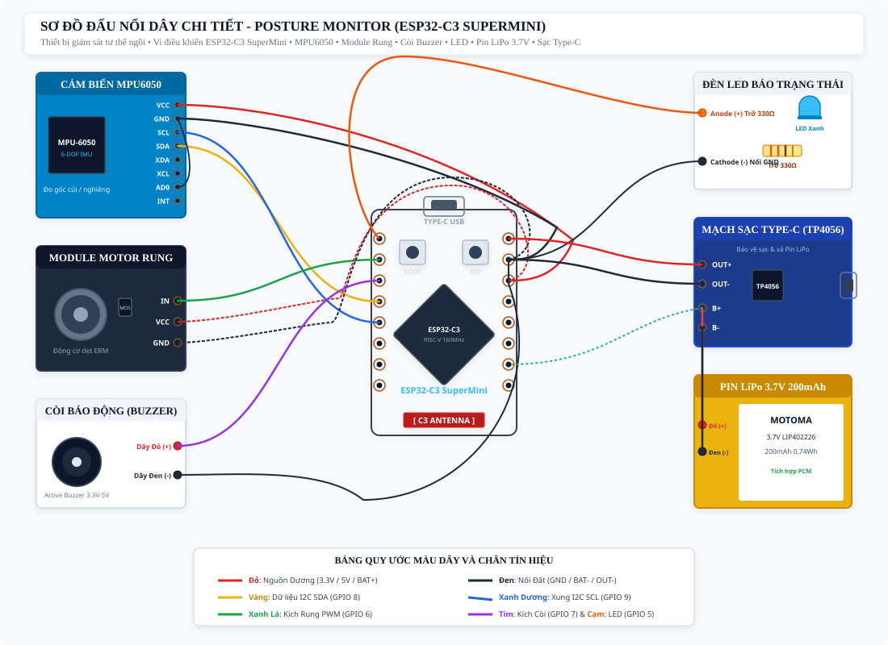

# SƠ ĐỒ ĐẤU NỐI VÀ HƯỚNG DẪN ĐI DÂY PHẦN CỨNG
## Hệ Thống Giám Sát Tư Thế Ngồi (ESP32-C3 SuperMini)

> **Vi điều khiển**: ESP32-C3 SuperMini (RISC-V 160MHz, tích hợp sạc & nạp Type-C)  
> **Linh kiện ngoại vi**: Cảm biến MPU6050, Module Rung 3 chân, Còi Buzzer 2 dây, LED Xanh 5mm  
> **Hệ thống nguồn**: Pin LiPo 3.7V 200mAh (MOTOMA) + Mạch sạc bảo vệ Type-C (TP4056)  
> **Phiên bản phần cứng**: Rev 1.2 • **Ngày cập nhật**: 2026-09-20  

---

## 1. SƠ ĐỒ ĐẤU NỐI VÀ ĐI DÂY TRỰC QUAN TỔNG THỂ

Sơ đồ dưới đây minh họa trực quan cách đi dây giữa các linh kiện thực tế theo đúng vị trí chân cắm trên bo mạch:

*Nguyên tắc phân bổ chân*: Toàn bộ chân I/O được bố trí đối xứng thuận tiện cho việc sắp đặt dây trong vỏ hộp siêu nhỏ: Cảm biến I2C giao tiếp qua GPIO 8 (SDA) và GPIO 9 (SCL); Động cơ rung điều khiển qua GPIO 6; Còi báo động qua GPIO 7; Đèn LED chẩn đoán qua GPIO 5; Cực âm toàn bộ mạch nối chung về chân G (GND).

---

## 2. BẢNG TRA CỨU ĐẤU NỐI CHI TIẾT TỪNG CHÂN (PINOUT MAPPING)

| Tên Linh Kiện | Chân Linh Kiện | Nối Vào ESP32-C3 | Màu Dây Khuyến Nghị | Chức Năng & Ghi Chú Kỹ Thuật |
| :--- | :--- | :--- | :---: | :--- |
| **Cảm biến MPU6050** (Đo góc 6 trục) | VCC GND SCL SDA AD0 | Chân 3.3 (3.3V) Chân G (GND) Chân 9 (GPIO 9) Chân 8 (GPIO 8) Nối chung GND | Đỏ Đen Xanh dương Vàng Đen | Nguồn 3.3V từ LDO trên board. Nối đất chung. Đường xung clock I2C. Đường dữ liệu I2C. Cố định địa chỉ I2C = 0x68. |
| **Module Rung 3 Chân** (Cảnh báo xúc giác) | IN (Tín hiệu) VCC (Nguồn) GND (Đất) | Chân 6 (GPIO 6) Chân 3.3 (3.3V) Chân G (GND) | Xanh lá Đỏ Đen | Module đã có sẵn transistor và diode dập xung trên mạch, nối trực tiếp không cần thêm linh kiện rời. |
| **Còi Chip (Buzzer)** (Cảnh báo âm thanh) | Dây Đỏ (+) Dây Đen (-) | Chân 7 (GPIO 7) Chân G (GND) | Tím / Đỏ Đen | Kích còi qua GPIO 7. Nếu là còi điện động ăn dòng lớn, mắc thêm 1 điện trở 100Ω để bảo vệ chân chip. |
| **Đèn LED Xanh** (Báo trạng thái) | Anode (+) Cathode (-) | Chân 5 (GPIO 5) Chân G (GND) | Cam Đen | Bắt buộc mắc nối tiếp điện trở 330Ω vào chân Anode (chân dài) trước khi cắm vào GPIO 5 để tránh cháy LED. |
| **Mạch Sạc TP4056** (Cổng Type-C & Bảo vệ) | OUT+ OUT- B+ B- | Chân 5V Chân G (GND) Cực Dương Pin Cực Âm Pin | Đỏ Đen Đỏ Đen | Cấp nguồn 3.7V - 4.2V vào chân 5V của ESP32; IC nguồn ME6211 trên board sẽ hạ áp xuống 3.3V sạch. |
| **Pin LiPo 3.7V** (200mAh MOTOMA) | Dây Đỏ (+) Dây Đen (-) | Chân B+ (TP4056) Chân B- (TP4056) | Đỏ Đen | Pin có tích hợp sẵn mạch bảo vệ PCM chống quá dòng, chống chập và ngắt khi pin xuống dưới 2.5V. |

---

## 3. HƯỚNG DẪN HÀN VÀ LẮP RÁP AN TOÀN TRONG VỎ HỘP

Để đảm bảo mạch hoạt động bền bỉ 24/7 và vừa vặn trong vỏ hộp kích thước nhỏ ($38 \times 28 \times 12\text{ mm}$):

1. **Chuẩn bị dây dẫn**: Sử dụng dây bọc silicon chịu nhiệt cỡ nhỏ (AWG 28 hoặc AWG 30). Dây mềm giúp dễ uốn gọn gàng và không gây lực căng bẻ gãy mối hàn khi đóng nắp hộp.
2. **Mối hàn mass (GND) tập trung**: Các chân GND của MPU6050, Module rung, Còi, LED và Mạch sạc nên được hàn chung vào một dải mass tập trung hình sao (Star Ground) để triệt tiêu nhiễu dao động điện thế.
3. **Cách điện và chống rung**: 
   - Luồn ống co nhiệt vào tất cả chân hở của LED, Còi và mối nối pin trước khi hàn.
   - Cảm biến MPU6050 phải được dán cố định chặt vào đáy vỏ hộp bằng băng keo xốp 3M để truyền lực trung thực từ chuyển động cơ thể mà không bị trượt lỏng.
   - Module rung cần được đệm nhẹ để xung rung hướng vào mặt sau (tiếp xúc lưng người dùng) thay vì rung lắc làm lỏng chân hàn MPU6050.

---

## 4. QUY TRÌNH KIỂM THỬ TỪNG BƯỚC SAU KHI HÀN (BRING-UP)

Trước khi đóng nắp hộp và dán tem, bắt buộc thực hiện kiểm tra theo trình tự 4 bước:

1. **Kiểm tra ngắn mạch (Short-circuit Test)**: Dùng đồng hồ VOM đo thông mạch giữa chân 3.3V và GND, giữa 5V và GND. Nếu có tiếng bíp liên tục tức là bị chập thiếc $\rightarrow$ Phải tách mối chập trước khi cấp nguồn!
2. **Cấp nguồn qua cổng Type-C**: Cắm cáp Type-C vào ESP32-C3 SuperMini. Đèn LED đỏ báo nguồn trên board phải sáng đều. Đo điện áp giữa chân 3.3V và GND phải đạt $3.28\text{ V} - 3.32\text{ V}$.
3. **Kiểm tra đường truyền cảm biến I2C**: Nạp firmware. Mở Serial Monitor (115200 baud). Dòng log phải báo `MPU6050 Connection OK` (địa chỉ `0x68`). Nếu báo lỗi, kiểm tra lại dây SDA (GPIO 8) và SCL (GPIO 9).
4. **Kiểm tra rung, còi và nút bấm**: Nhấn giữ nút BOOT trên board 2 giây. Thiết bị rung nhẹ 1 nhịp, đèn LED chớp nhanh để lấy mốc tư thế, sau đó rung 2 nhịp xác nhận hoàn tất thành công.
