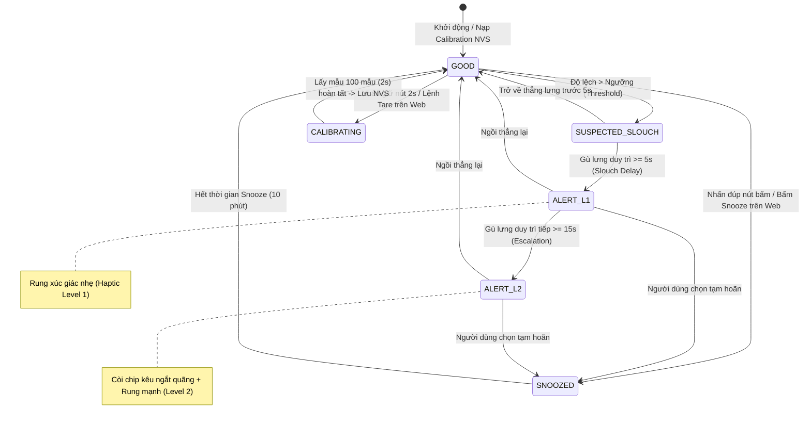
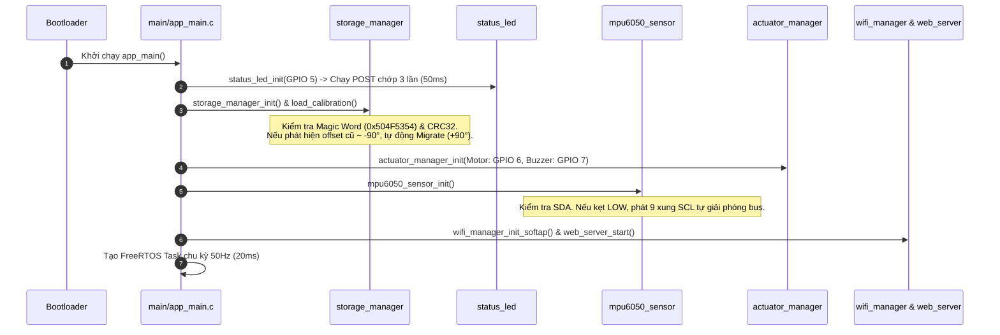

# KIẾN TRÚC PHẦN MỀM VÀ LUỒNG CHƯƠNG TRÌNH (SOFTWARE ARCHITECTURE & PROGRAM FLOW)

> **Dự án**: ESP32-C3 Posture Monitor & Alert System  
> **Phiên bản Firmware**: `v1.1.2`  
> **Nền tảng**: ESP-IDF v5.5 (C/C++) & Arduino ESP32  
> **Ngày cập nhật**: 2026-09-20  

---

## 1. TỔNG QUAN KIẾN TRÚC HỆ THỐNG

Hệ thống giám sát tư thế Posture Monitor được thiết kế theo kiến trúc **phân lớp module hướng sự kiện (Event-Driven Layered Architecture)** với nguyên tắc:
* **Không phụ thuộc vòng lặp nghẽn (Zero Blocking Loops)**: Tất cả tác vụ phần cứng, LED, haptic motor, buzzer, và web server đều hoạt động phi nghẽn (non-blocking).
* **Bền vững trạng thái ("STATE IS KING")**: Dữ liệu hiệu chuẩn, ngưỡng góc và cấu hình rung/còi được lưu trữ tại bộ nhớ flash NVS với kiểm tra toàn vẹn CRC32 và cơ chế tự động chuyển đổi phiên bản (Migration).
* **Tách biệt cơ chấn cơ học (Acoustic-Haptic Decoupling)**: Tự động đóng băng trọng trường gia tốc kế trong thời gian motor rung để triệt tiêu nhiễu giả lập tức.

```
+-----------------------------------------------------------------------------------+
|               TẦNG TRÌNH DIỄN (PRESENTATION & USER INTERACTION)                  |
|  - Web Monitor UI (Mobile-First Apple Health, PWA Ready, Offline 100%)            |
|  - 3D Isometric Mini Skeleton Engine (Zero-dependency WebGL / 2D Canvas)          |
|  - Physical UI: Nút bấm đa năng (Single/Double/Long-press) & Status LED Đa sắc    |
+-----------------------------------------------------------------------------------+
                                         ▲
                                         │ (WebSocket 10Hz / REST JSON)
+-----------------------------------------------------------------------------------+
|               TẦNG GIAO VẬN & DỊCH VỤ MẠNG (COMMUNICATION & SERVICES)             |
|  - Wi-Fi SoftAP / Station Manager (`wifi_manager`)                                |
|  - ESP-IDF HTTP Server (`web_server`): REST Endpoints & WebSocket 10Hz Streaming   |
|  - Dual-OTA Firmware Engine (`esp_ota`): Phân vùng kép 1.75MB, Anti-Bricking      |
+-----------------------------------------------------------------------------------+
                                         ▲
                                         │ (Internal Telemetry Snapshot)
+-----------------------------------------------------------------------------------+
|               TẦNG XỬ LÝ LÕI & CƠ SINH HỌC (CORE LOGIC & BIOMECHANICS)           |
|  - Máy trạng thái hữu hạn FSM (`posture_core`): 6 trạng thái lũy tiến             |
|  - Bộ điều phối dữ liệu viễn trắc (`telemetry`): 50Hz Internal -> 10Hz Broadcast  |
|  - Quản lý cấu hình & Flash NVS (`storage_manager`): Magic Word + CRC32           |
+-----------------------------------------------------------------------------------+
                                         ▲
                                         │ (Physical Angles: Pitch, Roll, Yaw)
+-----------------------------------------------------------------------------------+
|               TẦNG PHẦN CỨNG & TRÌNH ĐIỀU KHIỂN (HARDWARE DRIVERS & HAL)          |
|  - IMU Driver (`mpu6050_sensor`): I2C Auto-Recovery, Complementary Filter, Yaw    |
|  - Actuator Manager (`actuator_manager`): PWM Haptic ERM Motor & Buzzer Patterns  |
|  - Status LED Controller (`status_led`): POST 50ms, Heartbeat, Alarm Cadence      |
|  - Battery Monitor (`battery_monitor`): ADC1 Curve-Fitting Calibration            |
+-----------------------------------------------------------------------------------+
```

---

## 2. CẤU TRÚC PHÂN TẦNG VÀ TRÁCH NHIỆM TỪNG MODULE

| Tầng kiến trúc | Module / File | Trách nhiệm chính |
| :--- | :--- | :--- |
| **Presentation** | `web/index.html`<br>`web/style.css`<br>`web/app.js` | Giao diện điều khiển Web Monitor chuẩn Apple Health, đa ngôn ngữ Anh - Việt, kết nối tự phục hồi WebSocket/REST. |
| **Presentation** | `web/skeleton3d.js` | Engine 3D không gian thực (<12KB, nhúng Flash), động học thuận (Forward Kinematics 10 đốt) hiển thị đồng thời Roll, Pitch, Yaw. |
| **Communication** | `web_server.c` | Máy chủ HTTP phi nghẽn, phục vụ asset nén nhúng bộ nhớ, REST API (`/api/status`, `/api/config`, `/api/calibrate`, `/api/snooze`), WebSocket 10Hz broadcast, OTA firmware streamer. |
| **Communication** | `wifi_manager.c` | Khởi tạo Wi-Fi SoftAP `Posture-Monitor-AP` (IP `192.168.4.1`) và cơ chế quản lý sóng RSSI. |
| **Core Logic** | `posture_core.c` | Máy trạng thái FSM 6 mức, đo độ lệch cơ học $\Delta = \sqrt{\Delta r^2 + \Delta p^2}$, đếm thời gian trễ gù lưng và leo thang báo động. |
| **Core Logic** | `telemetry.c` | Gom cụm dữ liệu viễn trắc 50Hz, chụp snapshot thread-safe cho Web Server. |
| **Core Logic** | `storage_manager.c` | Đọc/ghi cấu hình calibration vào NVS flash, kiểm tra toàn vẹn IEEE 802.3 CRC32, tự động di chuyển dữ liệu legacy. |
| **Drivers / HAL** | `mpu6050_sensor.c` | Giao tiếp I2C bus tốc độ 400kHz, 9-clock bus lockup recovery, bộ lọc bù dọc trục sống lưng $\text{atan2}(a_z, a_x)$, tích phân góc xoay Yaw. |
| **Drivers / HAL** | `actuator_manager.c`| Điều chế xung không nghẽn cho motor rung (GPIO 6) và còi chip (GPIO 7). |
| **Drivers / HAL** | `status_led.c` | Điều khiển đèn LED trạng thái (GPIO 5) qua bộ định thời phần cứng Timer 50ms. |
| **Drivers / HAL** | `battery_monitor.c`| Đo điện áp pin LiPo qua ADC1 CH1 (GPIO 1), hiệu chuẩn Curve-fitting, lọc thông thấp EMA. |

---

## 3. MÁY TRẠNG THÁI HỮU HẠN FSM (POSTURE STATE MACHINE)

Hệ thống triển khai FSM lũy tiến 6 trạng thái nhằm đảm bảo trải nghiệm người dùng tự nhiên, tránh báo động giả khi người dùng chỉ cúi tạm thời lấy đồ vật:



### Bảng Định Nghĩa Trạng Thái FSM

| Trạng thái (`posture_fsm_state_t`) | Điều kiện kích hoạt | Phản hồi phần cứng | Đèn LED (GPIO 5) |
| :--- | :--- | :--- | :--- |
| `POSTURE_STATE_GOOD` | Độ lệch góc $\Delta \le \text{Threshold}$ | Tắt motor rung và còi | Nhịp tim (Heartbeat: chớp 60ms mỗi 2s) |
| `POSTURE_STATE_SUSPECTED_SLOUCH` | $\Delta > \text{Threshold}$ trong thời gian $< 5\,\text{s}$ | Yên lặng (chờ hết thời gian ân hạn) | Nhấp nháy cảnh báo 2 Hz |
| `POSTURE_STATE_ALERT_L1` | Duy trì sai tư thế $\ge 5\,\text{s}$ | Rung haptic nhịp nhàng (200ms ON / 300ms OFF) | Nhấp nháy cảnh báo 2 Hz |
| `POSTURE_STATE_ALERT_L2` | Sai tư thế kéo dài thêm $\ge 15\,\text{s}$ | Còi chip kêu bíp 3 nhịp dồn dập + Rung liên tục | Chớp nhanh báo động 5 Hz |
| `POSTURE_STATE_SNOOZED` | Người dùng kích hoạt tạm hoãn 10 phút | Tắt toàn bộ rung và còi trong 600 giây | Chớp chậm thở (Breathing: 0.6 Hz) |
| `POSTURE_STATE_CALIBRATING` | Bắt đầu chu trình Tare | Rung nhẹ 100ms báo hiệu bắt đầu và kết thúc | Chớp siêu nhanh 10 Hz |

---

## 4. LUỒNG CHƯƠNG TRÌNH VÀ SƠ ĐỒ TUẦN TỰ (PROGRAM FLOW & SEQUENCE)

### A. Luồng Khởi Động Hệ Thống (Boot Sequence)


### B. Vòng Lặp Xử Lý Thời Gian Thực 50Hz (50Hz Real-Time Loop)
Mỗi chu kỳ $20\,\text{ms}$ ($\Delta t = 0.02\,\text{s}$), CPU thực hiện các bước tuần tự không nghẽn:
1. **Poll Sensors**: Đọc thanh ghi Accelerometer và Gyroscope từ MPU6050 qua DMA/I2C.
2. **Complementary Filter**:
   $$\text{roll\_acc} = \text{atan2f}(a_z, a_x) \cdot \frac{180}{\pi}$$
   $$\text{pitch\_acc} = \text{atan2f}(a_y, \sqrt{a_x^2 + a_z^2}) \cdot \frac{180}{\pi}$$
   Nếu motor đang rung (`freeze_accel_bias == true`), bỏ qua trọng trường và chỉ tích phân con quay.
3. **Yaw Tracking**: Chiếu vận tốc góc lên véc-tơ trọng lực thực $\omega_{\text{yaw}} = (\vec{a} \cdot \vec{g}) / \|\vec{a}\|$, lọc vùng chết ($> 0.35^\circ/\text{s}$), tích phân và chuẩn hóa $\pm 180^\circ$.
4. **FSM Evaluation**: Tính toán độ lệch $\Delta$, cập nhật bộ đếm thời gian gù lưng, quyết định trạng thái tiếp theo.
5. **Actuator Update**: Điều phối dạng xung rung và còi.
6. **Battery Monitor**: Lấy mẫu ADC1 mỗi 1 giây (50 chu kỳ).
7. **Telemetry Broadcast**: Mỗi $100\,\text{ms}$ (5 chu kỳ = 10Hz), đóng gói khung JSON snapshot và phát thanh tới toàn bộ WebSockets đang kết nối.

---

## 5. KIẾN TRÚC PHÂN VÙNG BỘ NHỚ VÀ DUAL-OTA FIRMWARE ENGINE

Để bảo vệ thiết bị hoạt động liên tục 24/7 và hỗ trợ cập nhật từ xa an toàn tuyệt đối, bộ nhớ Flash 4MB được chia thành 2 phân vùng ứng dụng đối xứng:

### Flash Memory Map (`partitions.csv`)
```csv
# ESP-IDF Partition Table
# Name,   Type, SubType, Offset,  Size, Flags
nvs,      data, nvs,     0x9000,  0x6000,
otadata,  data, ota,     0xf000,  0x2000,
ota_0,    app,  ota_0,   0x20000, 1792K,
ota_1,    app,  ota_1,   ,        1792K,
```

### Chuỗi Bảo Vệ Chống Brick Firmware (Anti-Bricking Safety Chain)
1. **Khóa Pin Yếu (Low-Battery Lockout)**: Từ chối yêu cầu nạp OTA nếu pin $< 20\%$ (`HTTP 403 Forbidden`) để ngăn mất nguồn đột ngột giữa chừng.
2. **Kiểm Tra Magic Byte**: Byte đầu tiên của luồng truyền phải là `0xE9` (ESP32 Binary Image Header). Các file không phải firmware bị từ chối ngay tức thì (`HTTP 400 Bad Request`).
3. **Truyền Dữ Liệu Theo Luồng Phân Đoạn (Chunked Streaming)**: Buffer $1024\,\text{bytes}$ ghi trực tiếp vào phân vùng OTA đích qua `esp_ota_write()`. Trong suốt quá trình nạp, hệ thống tạm dừng rung/còi và bật đèn LED chớp nhịp nhanh 5 Hz.
4. **Kiểm Tra Toàn Vẹn SHA-256**: Hàm `esp_ota_end()` xác thực tính toàn vẹn của image trước khi gọi `esp_ota_set_boot_partition()`.
5. **Hẹn Giờ Khởi Động Lại Không Nghẽn (Delayed Restart Timer)**: Khởi tạo phần cứng timer $1500\,\text{ms}$ để đảm bảo phản hồi `HTTP 200 OK` kịp hoàn tất gửi về trình duyệt trước khi gọi `esp_restart()`.
6. **Tự Động Hủy Rollback (Automatic Rollback Cancellation)**: Khi boot vào firmware mới thành công, `app_main` gọi `esp_ota_mark_app_valid_cancel_rollback()` để xác nhận phiên bản mới hoạt động ổn định.
