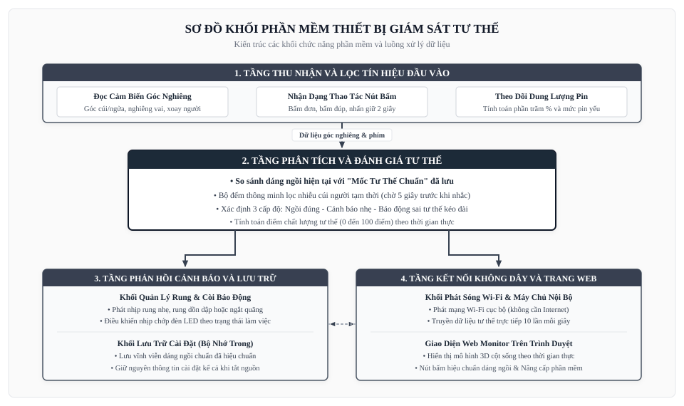

# SƠ ĐỒ KHỐI PHẦN MỀM THIẾT BỊ GIÁM SÁT TƯ THẾ

> **Thiết bị**: Máy Giám Sát Và Cảnh Báo Tư Thế Ngồi  
> **Tài liệu**: Thuyết Minh Sơ Đồ Khối Phần Mềm (Software Block Diagram)  
> **Phiên bản**: v1.1.2  
> **Ngày cập nhật**: 2026-09-20  

---

## 1. SƠ ĐỒ KHỐI PHẦN MỀM TỔNG THỂ

Sơ đồ dưới đây thể hiện kiến trúc 4 tầng chức năng phần mềm được thiết kế theo mô hình xử lý phân lớp hướng sự kiện, đảm bảo tính phản hồi nhanh và hoạt động mượt mà:

*Tóm tắt nguyên lý phần mềm*: Dữ liệu góc nghiêng từ cảm biến được tầng thu nhận lọc nhiễu rồi chuyển đến tầng phân tích trung tâm. Thuật toán thông minh sẽ so sánh dáng ngồi với mốc chuẩn và tính toán thời gian trễ chống báo động giả. Dựa trên kết quả, phần mềm điều khiển nhịp rung nhắc nhở, đồng bộ dữ liệu qua máy chủ Wi-Fi nội bộ đến trang web theo dõi theo thời gian thực.

---

## 2. CHI TIẾT CÁC TẦNG CHỨC NĂNG PHẦN MỀM

| Tầng chức năng | Các khối thành phần | Nhiệm vụ và cơ chế hoạt động |
| :--- | :--- | :--- |
| **1. Tầng Thu Nhận & Lọc Tín Hiệu** | Đọc góc nghiêng, Nhận dạng nút bấm, Theo dõi pin | Thu thập tín hiệu góc cúi/ngửa lưng, góc nghiêng vai và góc xoay thân người liên tục; phân tích chính xác các kiểu nhấn nút (bấm đơn, đúp, giữ lâu) và tính toán % pin. |
| **2. Tầng Phân Tích & Đánh Giá** | Thuật toán so sánh dáng chuẩn, Bộ đếm trễ thông minh, Tính điểm số | So sánh độ lệch cơ thể với dáng chuẩn đã lưu; kích hoạt bộ đếm thời gian 5 giây để tránh rung khi người dùng chỉ cúi nhặt đồ tạm thời; phân định 3 mức độ (Đúng - Cảnh báo - Báo động) và chấm điểm tư thế 0 - 100. |
| **3. Tầng Phản Hồi & Lưu Trữ** | Điều khiển rung và còi, Quản lý đèn LED, Khối lưu trữ bộ nhớ trong | Phát nhịp rung nhẹ hoặc rung dồn dập phù hợp với từng trạng thái; điều khiển nhịp chớp đèn LED; lưu trữ an toàn mốc dáng ngồi chuẩn vào bộ nhớ máy để không bị mất khi tắt nguồn. |
| **4. Tầng Kết Nối Không Dây & Web** | Phát Wi-Fi nội bộ, Máy chủ truyền dữ liệu, Giao diện Web Monitor | Tạo mạng sóng Wi-Fi cục bộ để điện thoại kết nối không dây; gửi dữ liệu tư thế 10 lần mỗi giây; hiển thị mô hình 3D cột sống cử động trực tiếp và hỗ trợ nạp phần mềm mới qua mạng. |

---

## 3. QUY TRÌNH XỬ LÝ VÀ RA QUYẾT ĐỊNH CỦA PHẦN MỀM

Phần mềm vận hành tuần hoàn theo chu trình khép kín 4 giai đoạn:

1. **Giai đoạn 1 - Thu nhận tín hiệu**:
   Cảm biến gửi các thông số chuyển động về máy. Tín hiệu được lọc để loại bỏ rung lắc nhẹ khi cơ thể hô hấp hoặc cử động tay chân thông thường.
2. **Giai đoạn 2 - So khớp và phân loại tư thế**:
   Thuật toán so sánh dáng hiện tại với mốc chuẩn. Nếu độ lệch vượt quá giới hạn cho phép, hệ thống bắt đầu đếm thời gian trễ. Nếu người dùng thẳng lưng lại trong vòng 5 giây, cảnh báo được hủy bỏ tức thì.
3. **Giai đoạn 3 - Phát lệnh nhắc nhở**:
   Nếu sai tư thế duy trì liên tục quá 5 giây, phần mềm kích hoạt motor rung nhẹ ở lưng. Nếu tiếp tục sai tư thế quá lâu, còi chíp sẽ phát âm thanh cảnh báo tăng dần.
4. **Giai đoạn 4 - Đồng bộ không dây**:
   Toàn bộ diễn biến tư thế, điểm số tích lũy trong ngày và góc nghiêng được phát sóng không dây đến trình duyệt điện thoại để người dùng theo dõi trực quan.
