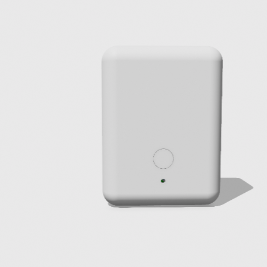
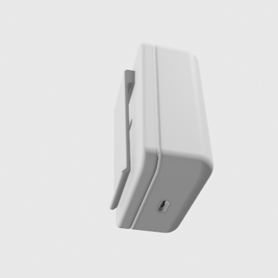
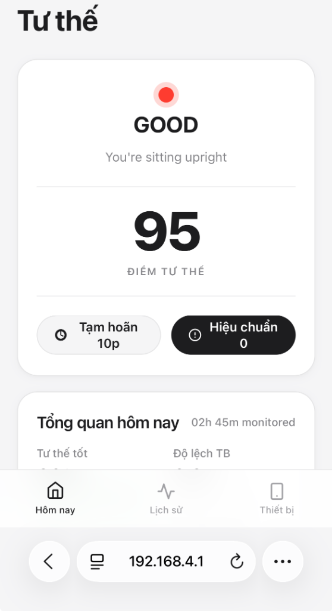

# HƯỚNG DẪN SỬ DỤNG VÀ VẬN HÀNH THIẾT BỊ

> **Thiết bị**: Máy Giám Sát Và Cảnh Báo Tư Thế Ngồi  
> **Phiên bản hướng dẫn**: v1.1.2  
> **Ngày cập nhật**: 2026-09-20  

---

## 1. HƯỚNG DẪN BẮT ĐẦU NHANH

### Bước 1: Đeo thiết bị lên cơ thể
1. Gắn thiết bị vào dây đeo ngực hoặc kẹp vào cổ áo / mặt sau áo bằng ngàm kẹp tích hợp.
2. **Vị trí chuẩn**: Đặt thiết bị nằm dọc chính giữa lưng trên, ở khoảng giữa hai bả vai.
3. **Chiều thiết bị**: Cổng sạc Type-C hướng xuống dưới, mặt có nút bấm và đèn báo hướng ra ngoài.

{width=38%}
{width=38%}

```
       [ Cổ ]
         │
    ┌────┴────┐
 [Bả vai]  [Bả vai]
    └────┬────┘
     [THIẾT BỊ]  <-- Vị trí giữa hai bả vai
         │
      [ Lưng ]
```

### Bước 2: Bật nguồn thiết bị
* Bật công tắc nguồn hoặc cắm sạc qua cổng sạc Type-C ở cạnh dưới máy.
* Đèn báo trạng thái sẽ nhấp nháy nhanh 3 lần để xác nhận thiết bị đã sẵn sàng.
* Thiết bị rung nhẹ 1 nhịp báo hiệu bắt đầu làm việc.

---

## 2. THAO TÁC VỚI NÚT BẤM

Thiết bị chỉ có một nút bấm duy nhất trên thân máy, hỗ trợ 3 thao tác cơ bản:

```
[ Nút bấm ] ──┬── Bấm 1 lần     ---> Tắt rung cảnh báo tức thì
              ├── Bấm 2 lần     ---> Tạm dừng theo dõi trong 10 phút
              └── Giữ 2 giây    ---> Lấy lại tư thế chuẩn (Hiệu chuẩn)
```

| Thao tác | Cách thực hiện | Phản hồi từ thiết bị | Chức năng |
| :--- | :--- | :--- | :--- |
| **Bấm 1 lần** | Nhấn và thả ngay | Thiết bị ngừng rung ngay lập tức | Tắt cảnh báo hiện tại nếu bạn chưa thể ngồi thẳng lưng ngay. |
| **Bấm đúp** (2 lần) | Nhấn 2 lần liên tiếp | Rung nhẹ 2 nhịp ngắn | **Tạm dừng 10 phút**: Tắt toàn bộ rung nhắc nhở khi bạn đứng dậy đi lại hoặc nghỉ ngơi. |
| **Nhấn giữ** | Nhấn và giữ trong 2 giây | Rung dài 1 nhịp | **Hiệu chuẩn tư thế**: Đặt lại mốc chuẩn cho dáng ngồi hiện tại của bạn. |

---

## 3. BẢNG MÃ ĐÈN BÁO TRẠNG THÁI

Đèn báo trên thiết bị giúp bạn nhận biết tình trạng hoạt động nhanh chóng:

| Kiểu nhấp nháy | Tần suất đèn | Trạng thái thiết bị | Ý nghĩa và hành động |
| :--- | :--- | :--- | :--- |
| **Chớp nhanh 3 lần** | Ngay khi mở nguồn | Khởi động hoàn tất | Thiết bị đã sẵn sàng làm việc. |
| **Chớp nhẹ theo nhịp** | 2 giây chớp 1 lần | Tư thế chuẩn | Bạn đang ngồi thẳng lưng đúng cách. |
| **Nhấp nháy đều đặn** | Chớp tắt liên tục | Cảnh báo sai tư thế | Bạn đang có dấu hiệu gù lưng hoặc nghiêng người. |
| **Nhấp nháy dồn dập** | Chớp rất nhanh kèm rung | Báo động sai tư thế | Bạn đã ngồi sai tư thế quá lâu, cần điều chỉnh lại. |
| **Chớp chậm** | Chớp tắt cách quãng chậm | Đang tạm dừng | Thiết bị đang trong thời gian nghỉ 10 phút. |
| **Chớp liên tục siêu tốc** | Nhấp nháy liên tục không nghỉ | Đang hiệu chuẩn | Thiết bị đang đo dáng ngồi, vui lòng giữ yên người. |
| **Sáng mờ hoặc tắt hẳn** | Đèn đứng yên hoặc không sáng | Pin yếu hoặc cần kiểm tra | Cắm sạc pin cho thiết bị. |

---

## 4. KẾT NỐI VÀ THEO DÕI QUA TRANG WEB

Thiết bị phát sóng mạng không dây cục bộ, cho phép theo dõi tư thế trực tiếp trên điện thoại hoặc máy tính mà không cần cài đặt phần mềm hay kết nối internet:

```
+-------------------------------------------------------------------------------+
| BƯỚC 1: Mở cài đặt Wi-Fi trên điện thoại, tìm và kết nối mạng:                |
|         Tên Wi-Fi (SSID): Posture-Monitor-AP                                  |
|         Mật khẩu:         posture123                                          |
+-------------------------------------------------------------------------------+
                                         │
                                         ▼
+-------------------------------------------------------------------------------+
| BƯỚC 2: Mở trình duyệt web và truy cập địa chỉ:                               |
|         http://192.168.4.1                                                    |
+-------------------------------------------------------------------------------+
```

{width=36%}

### Các tính năng trên trang web theo dõi:
1. **Mô hình 3D cột sống**:
   * Hiển thị mô phỏng dáng ngồi theo thời gian thực.
   * Dùng ngón tay vuốt trên màn hình để xoay góc nhìn quanh cơ thể.
   * Chụm hoặc mở hai ngón tay để phóng to, thu nhỏ góc nhìn.
   * Nút đặt lại góc nhìn giúp đưa camera về vị trí quan sát mặc định.
2. **Thông số góc nghiêng cơ thể**:
   * **Góc cúi/ngửa**: Thể hiện độ gập lưng về phía trước (bằng 0 khi ngồi thẳng).
   * **Góc nghiêng vai**: Thể hiện độ lệch vai sang trái hoặc sang phải.
   * **Góc xoay người**: Thể hiện độ vặn người quanh trục cột sống.
   * **Tổng độ lệch**: Độ lệch tổng thể so với tư thế chuẩn ban đầu.
3. **Biểu đồ hoạt động**:
   * Đường đồ thị thể hiện diễn biến tư thế trong 30 giây gần nhất kèm vạch ngưỡng cảnh báo.
4. **Thống kê và lịch sử**:
   * Bảng theo dõi chất lượng tư thế theo từng giờ trong ngày.
   * Tỷ lệ phần trăm thời gian ngồi đúng và thời gian ngồi gù lưng.
   * Nút xuất dữ liệu để tải báo cáo về máy.

---

## 5. QUY TRÌNH HIỆU CHUẨN TƯ THẾ CHUẨN

Hiệu chuẩn là bước quan trọng nhất để thiết bị ghi nhận đúng dáng vóc chuẩn của từng người:

```
                  4 ĐIỂM TƯ THẾ CHUẨN
          
    1. Lưng tựa thẳng tự nhiên vào ghế.
    2. Hai vai thả lỏng, cân bằng đều hai bên.
    3. Cằm song song với mặt đất, mắt nhìn thẳng.
    4. Hai bàn chân đặt phẳng trên mặt sàn.
```

### Các bước thực hiện:
1. Ngồi vào tư thế chuẩn theo 4 điểm nêu trên.
2. **Thao tác**: Nhấn giữ nút trên thiết bị trong 2 giây, hoặc bấm nút "Hiệu chuẩn" trên trang web.
3. **Giữ yên cơ thể trong 3 giây**: Đèn báo sẽ chớp rất nhanh trong lúc máy ghi nhận tư thế chuẩn.
4. Khi hoàn thành, thiết bị sẽ rung 2 nhịp ngắn để xác nhận đã lưu thành công.

---

## 6. CẬP NHẬT PHẦN MỀM KHÔNG DÂY

Khi có phiên bản phần mềm mới, bạn có thể cập nhật trực tiếp qua trang web mà không cần cắm dây cáp:

```
[ Điện thoại / Máy tính ]
          │
          │ Chọn file cập nhật phần mềm mới
          ▼
Trang web (http://192.168.4.1 -> Tab "Thiết bị")
          │
          │ Chọn file và bấm "Cập nhật"
          ▼
[ Thiết bị tiếp nhận và tự động nâng cấp ]
          │
          ▼
[ Tự động khởi động lại sau khi hoàn tất ]
```

> **Lưu ý quan trọng khi cập nhật**:
> 1. Đảm bảo mức pin còn trên 20% trước khi thực hiện.
> 2. Không tắt nguồn thiết bị hoặc ngắt kết nối mạng trong lúc quá trình nạp đang diễn ra (khoảng 15 giây).
> 3. Sau khi cập nhật xong, thiết bị sẽ tự khởi động lại và kết nối lại bình thường.

---

## 7. XỬ LÝ SỰ CỐ THƯỜNG GẶP

| Hiện tượng | Nguyên nhân có thể | Cách khắc phục |
| :--- | :--- | :--- |
| **Đèn sáng đứng yên hoặc báo mất cảm biến** | Thiết bị gặp gián đoạn tiếp xúc nội bộ | Tắt nguồn, chờ 5 giây rồi bật lại. Nếu vẫn bị, vui lòng liên hệ kỹ thuật để được hỗ trợ. |
| **Không tìm thấy Wi-Fi Posture-Monitor-AP** | Thiết bị đang tắt hoặc đã hết pin | Bật công tắc nguồn hoặc cắm cáp sạc pin cho thiết bị. |
| **Mô hình 3D bị lệch khi đang ngồi thẳng** | Chưa lấy lại mốc tư thế cho dáng người của bạn | Ngồi thẳng lưng đúng tư thế chuẩn và nhấn giữ nút 2 giây để hiệu chuẩn lại. |
| **Thiết bị không rung khi ngồi gù lưng** | Tính năng rung đang tắt trong phần cài đặt hoặc pin yếu | Mở trang web, kiểm tra công tắc "Động cơ rung" đã được bật hay chưa, đồng thời cắm sạc pin. |
